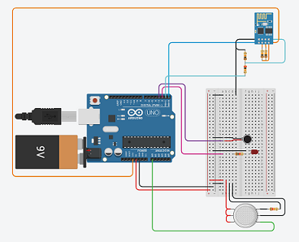

# GazIOT


## Presentation
Here is a tear gas detector that may be useful during events, this detector will vibrate and light a LED before sending you a notification on your mobile phone when tear gas is detected.

## Team
* Barseyni Nicolas
* Colat Loïc
* Da Roit Hugo
* Dormoy Guillaume
* Malivert Christopher

## Table of contents
+ [Material](#Material)
+ [Step1](#Step1)
+ [Step2](#Step2)
+ [Step3](#Step3)
+ [Link](#Link)

## Material


+ 1 Arduino
+ 1 mini breadboard
+ 1 gas sensor
+ 1 vibrating motor
+ 1 LED
+ 1 Bluetooth device
+ 1 battery
+ 25 cables
+ 6 resistors

## Step1
### Connecting your Arduino to your computer
First of all it will be necessary to load the code into the microcontroller via USB and the "Arduino IDE" software.
```C++
#define LED_PIN 2
#define VIBRATOR 3
#define GAZ_PIN A0

void setup()
{
  pinMode(LED_PIN, OUTPUT);
  pinMode(VIBRATOR, OUTPUT);
  pinMode(GAZ_PIN, INPUT);
  Serial.begin(9600);
}

void loop()
{
  delay(10); // for simulation performance
  int gazValue = analogRead(GAZ_PIN);
 
  if (Serial.available() > 0) {
	Serial.println(Serial.read(), DEC);
  }

  if (gazValue > 600) {
	digitalWrite(LED_PIN, HIGH);
	digitalWrite(VIBRATOR, HIGH);
	Serial.println("GAZ_DETECTED");
	delay(2000);
  } else {
	digitalWrite(LED_PIN, LOW);
	digitalWrite(VIBRATOR, LOW);
  }
}
```

Open the Arduino software
Select "Arduino Uno" in Tools -> Map Type.
In Tools -> Port: select the USB port corresponding to the port you used to connect your Arduino (on windows go to Settings -> Bluetooth devices and others to see which port your Arduino is on).
In File -> Examples -> Basics: select the program
Once the program is open, press the Check button and then the Upload button.
If everything goes well, the LED "L" on your Arduino will start flashing.
You have loaded your first program on your Arduino microcontroller, congratulations! 

## Step2
### Connecting the components to the Arduino
We will now connect the components to each other to link them to the arduino.

| Composant1       | pin     | Composant2       | pin              |
|------------------|---------|------------------|------------------|
| Arduino          | 5V      | Breadboard       | +                |
| Arduino          | GND     | Breadboard       | -                |
| Breadboard       | +       | Breadboard       | 27.a             |
| Breadboard       | -       | Breadboard       | 28.a             |
| gas sensor       | A2      | Breadboard       | 27.b             |
| gas sensor       | H1      | Breadboard       | 27.b             |
| gas sensor       | A1      | Breadboard       | 27.b             |
| gas sensor       | B1      | Arduino          | A0               |
| gas sensor       | B2      | resistor2        | borne1           |
| gas sensor       | H2      | Breadboard       | 28.d             |
| resistor2        | borne2  | Breadboard       | 28.c             |
| Arduino          | D2      | Breadboard       | 19.a             |
| Arduino          | D3      | Breadboard       | 15.a             |
| Arduino          | D1      | resistor8        | borne2           |
| Arduino          | D0      | Bluetooth device | TX               |
| resistor1        | borne1  | Breadboard       | 19.d             |
| resistor1        | borne2  | Breadboard       | 19.f             |
| vibrating motor  | négatif | Breadboard       | 14.a             |
| vibrating motor  | positif | Breadboard       | 15.a             |
| Breadboard       | 14.a    | Breadboard       | -                |
| LED              | Anode   | Breadboard       | 19.g             |
| LED              | Cathode | Breadboard       | 18.g             |
| Breadboard       | 18.f    | Breadboard       | -                |
| resistor8        | borne1  | Bluetooth device | RX               |
| resistor4        | borne1  | Bluetooth device | RX               |
| resistor4        | borne2  | Bluetooth device | Ground           |
| Breadboard       | 1.e     | Bluetooth device | Ground           |
| Bluetooth device | Activer | resistor7        | borne2           |
| resistor7        | borne1  | resistor6        | borne1           |
| resistor6        | borne1  | Bluetooth device | Alimentation     |
| resistor6        | borne2  | Bluetooth device | Reset            |
| Arduino          | 3.3V    | Bluetooth device | Alimentation     |
| battery          | positif | Arduino          |                  |
| battery          | négatif | Arduino          |                  |

## Step3
### Conclusion
Congratulations, you have just created your tear gas detector "GazIOT".
You are ready to go to a demonstration to claim your rights, or simply to attend it.

## Link
+ [thinkercad](_https://www.tinkercad.com/things/hsTh2XjKJng-amazing-densor/editel?tenant=circuits&sharecode=qoGlJLPNmIi50orQ0rCs77jslDYdPzyXEAgLbSYyFZs)
+ [3D view](https://www.tinkercad.com/things/lRItPivcIXB-gaziot/edit?sharecode=J9wXbBGpnQkKYdp2Et2Vop94DHTuPWfHTdaguoVU4mM)
